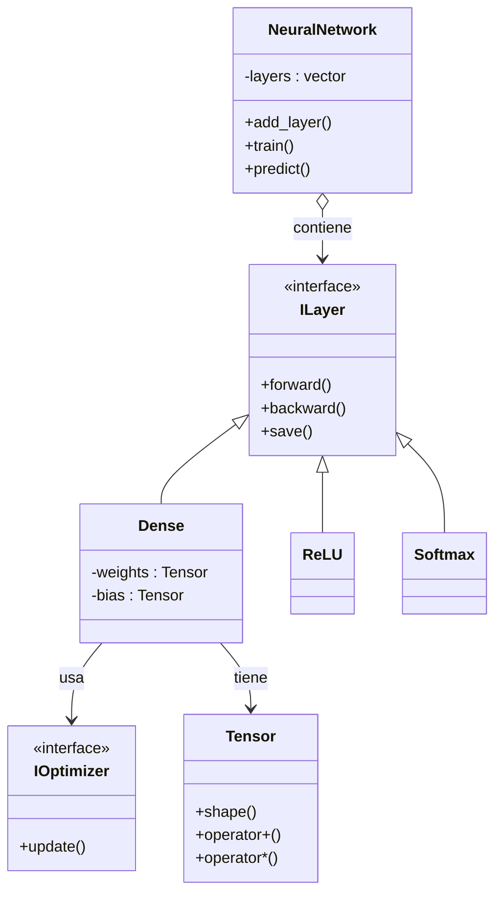

[](https://classroom.github.com/a/o8XztwuW)
# Proyecto Final 2025-2: AI Neural Network
## **CS2013 Programación III** · Informe Final
**Grupo 666 – Universidad de Ingeniería & Tecnología (UTEC)**

## Descripción

Este proyecto desarrolla **un framework completo de Neuronas artificiales en C++20 desde cero**, sin dependencias externas de álgebra lineal. Se implementa:

- Un motor tensorial eficiente (`Tensor<T,2>`).
- Una arquitectura general para redes neuronales completamente funcional:
    - Capas densas
    - Funciones de activación (ReLU, Sigmoid, Softmax)
    - Propagación Forward/Backward
    - Funciones de pérdida (MSE, BCE, CrossEntropy)
    - Optimizadores (SGD)
- Tres aplicaciones prácticas:
    - **PatternClassifier**: clasificación de patrones geométricos.
    - **SequencePredictor**: predicción de secuencias numéricas.
    - **ControllerDemo + EnvGym**: controlador autoaprendido en entorno físico simulado.
- Un **Pipeline Experimental** con:
    - Random Search
    - Grid Search
    - Hill Climbing
- Una interfaz de usuario en consola intuitiva, interactiva y robusta.

El proyecto cumple estrictamente los criterios de **funcionamiento**, **eficiencia**, **diseño de software**, **documentación**, **pruebas** e **ingeniería de software profesional**, según la rúbrica académica.

---

# Contenidos
1. [Datos generales](#1-datos-generales)
2. [Requisitos e instalación](#2-requisitos-e-instalación)
3. [Investigación teórica](#3-investigación-teórica)
4. [Diseño e implementación](#4-diseño-e-implementación)
5. [Manual de Uso](#5-ejecución)
6. [Análisis del rendimiento y Pipelines](#6-análisis-del-rendimiento)
7. [Trabajo en equipo](#7-trabajo-en-equipo)
8. [Conclusiones](#8-conclusiones)
9. [Bibliografía](#9-bibliografía)
10. [Diagramas UML](#10-diagrama-uml)

---

# 1. Datos generales

* **Curso**: Programación III
* **Tema**: Redes Neuronales y Algoritmos de Optimización en C++
* **Grupo**: **666**

## Integrantes (Plantilla editable)

| Código | Alumno | Rol Principal |
|:------:|:-------|:--------------|
| 20XXXXX | Alumno A | Desarrollo del Core (Tensor y NN) |
| 20XXXXX | Alumno B | Optimizadores y Funciones de Pérdida |
| 20XXXXX | Alumno C | Aplicaciones (Patterns / Sequence / Controller) |
| 20XXXXX | Alumno D | Pipelines y Pruebas Automatizadas |
| 20XXXXX | Alumno E | Documentación, UI y Video Demo |

> Se utilizó GitHub para control de versiones.

---

# 2. Requisitos e instalación

Este proyecto requiere:

- **C++20**
- **CMake 3.18+**
- **GCC 10+ / Clang 12+ / MSVC**
- **Sin librerías externas de álgebra lineal**

## Instalación

```bash
git clone https://github.com/usuario/proyecto-final-2025-2-grupo-666.git
cd proyecto-final-2025-2-grupo-666
mkdir build && cd build
cmake ..
make
```
---

# 3. Investigación Teórica

Se investigaron los siguientes fundamentos:

## Tensores y Broadcasting

Basado en **Golub & Van Loan (2013)**. Incluye:

* **Tensor 2D**
* **Broadcasting 1×N**
* **Dot product**
* **Operaciones vectorizadas**

---

## Propagación Forward y Backward

Implementada manualmente siguiendo a **Rumelhart, Hinton & Williams (1986)**.

---

## Funciones de Activación

* **ReLU**
* **Sigmoid**
* **Softmax con estabilización numérica**

---

## Optimización

* **SGD** (Descenso de Gradiente Estocástico)
* **Adam** (Momentos + corrección por sesgo)

---

## Funciones de Pérdida (Loss Functions)

* **MSE** (Error Cuadrático Medio)
* **BCE** (Pérdida de Entropía Binaria Cruzada)
* **CrossEntropyLoss** (Pérdida de Entropía Cruzada)

---

## Métodos de Búsqueda de Hiperparámetros

Basados en **Russell & Norvig (AI: A Modern Approach)**:

* **Random Search**
* **Grid Search**
* **Hill Climbing**
---

# 4. Diseño e implementación

## 4.1 Arquitectura de Clases
El diseño sigue principios SOLID, utilizando polimorfismo y templates de C++20.

* **`utec::algebra::Tensor<T, DIMS>`**: El núcleo matemático. Gestiona la memoria y las operaciones algebraicas.
* **`utec::neural_network::ILayer`**: Interfaz base para todas las capas. Define `forward`, `backward`, `update_params` y métodos de serialización.
* **`utec::neural_network::IOptimizer`**: Interfaz para estrategias de actualización de pesos (`SGD`, `Adam`).
* **`utec::neural_network::ILoss`**: Abstracción para calcular el error y su gradiente.

* **Estructura de carpetas**:

  ```
  proyecto-final/
  ├── include/
  │   └── utec/
  │       ├── algebra/
  │       │   └── tensor.h          # Core matemático
  │       ├── nn/
  │       │   ├── neural_network.h  # Clase contenedora principal
  │       │   ├── nn_dense.h        # Capa densa
  │       │   ├── nn_activation.h   # ReLU, Sigmoid, Softmax
  │       │   ├── nn_optimizer.h    # Adam, SGD
  │       │   └── nn_loss.h         # MSE, CrossEntropy
  │       └── apps/
  │           ├── ControllerDemo.h  # Lógica del controlador (Epic 3)
  │           ├── PatternClassifier.h
  │           ├── SequencePredictor.h
  │           ├── TrainingPipeline.h # Búsqueda de hiperparámetros
  │           ├── EnvGym.h          # Entorno de simulación
  |           └── Interfaz.h        # Interfaz amigable para interacción con usuario        
  ├── src/
  |     └── utec/
  |          └── apps/
  │               ├── ControllerDemo.cpp  # Lógica del controlador (Epic 3)
  │               ├── PatternClassifier.cpp
  │               ├── SequencePredictor.cpp
  │               ├── TrainingPipeline.cpp # Búsqueda de hiperparámetros
  │               ├── EnvGym.cpp          # Entorno de simulación
  |               └── Interfaz.cpp  
  |         
  ├── tests/
  |    ├── test_applications.cpp
  |    ├── test_neural_network.cpp
  |    └── test_tensor.cpp
  ├── docs/
  |    ├── BIBLIOGRAFIA.md
  |    └── README.md
  └──main.cpp                        # Punto de entrada
  ```

## 4.2 Motor Tensorial (`tensor.h`)

### Características:

* **Implementación desde cero**
* **Dot product O(n³)**
* **Broadcasting automático**
* **Transposición**
* **Funciones matemáticas:** `exp`, `log`, `sqrt`, `max`
* **Complejidad optimizada** usando estructuras compactas (`std::vector`)

---

## 4.3 Motor de Redes Neuronales

### Capas Implementadas:

* **Dense**
* **ReLU**
* **Sigmoid**
* **Softmax**

### Optimizadores:

* **SGD** (Descenso de Gradiente Estocástico)

### Funciones de Pérdida:

* **MSELoss** (Error Cuadrático Medio)
* **BCELoss** (Pérdida de Entropía Binaria Cruzada)
* **CrossEntropyLoss** (Pérdida de Entropía Cruzada)

### Serialización Total del Modelo:

* Permite **guardar/cargar pesos y biases** en archivo `.model`.

---

## 4.4 Aplicaciones EPIC 3

* **PatternClassifier:** Clasifica **3 patrones geométricos** utilizando la función de activación Softmax.
* **SequencePredictor:** Predice **secuencias numéricas** con un modelo de regresión entrenado mediante búsquedas locales aleatorias.
* **ControllerDemo + EnvGym:** Simula un **sistema físico simplificado** y entrena un controlador basado en **políticas aprendidas**.

---

## 4.4 Pipeline Experimental (`TrainingPipeline.h`)

Incluye:

* **Random Search**
* **Grid Search**
* **Hill Climbing**

Permite entrenar modelos sin reescribir código, cumpliendo **autonomía total del sistema**.


## 4.5 Manual de uso y casos de prueba

### 4.5.1 Interfaz de usuario

* **Cómo ejecutar**: `./pong_ai`
* **Al Iniciar, aparecerá un menú interactivo con opciones**:

=========================================
EPIC 3 - Neural Systems Interface
=========================================
1) Entrenar PatternClassifier - Acción: Entrena el clasificador de patrones (softmax)
2) Entrenar SequencePredictor - Acción: Entrena el predictor numérico de secuencias
3) Entrenar ControllerDemo - Entrena el controlador simplificado estilo gym
4) Probar modelos entrenados - Prueba uno o varios modelos ya entrenados
5) Guardar modelos - Guarda los modelos en archivos `.model`
6) Cargar modelos - Carga modelos guardados previamente
7) Ejecutar Pipeline Experimental - Ejecuta Random Search, Grid Search y Hill Climbing
8) Salir

### 4.5.2 Comandos de Caso de Prueba

* **Casos de prueba**:

  El proyecto incluye **tres módulos de pruebas automatizadas** en el directorio `tests/`, ejecutables mediante **CTest** o la configuración del IDE.

    * **Test unitario de capa densa** (`test_neural_network.cpp`):
        * **Valida el núcleo** de redes neuronales, incluyendo la capa `Dense` (propagación forward y backward) y las **Funciones de activación** (`ReLU`, `Sigmoid`, `Softmax`).
        * **Resultado Esperado:** Gradientes válidos después de la retropropagación y pérdida progresivamente decreciente en un modelo pequeño.
        * **Ejecutar con:** `./test_nn`

    * **Test de función de activación ReLU** (parte de `test_neural_network.cpp`):
        * **Evalúa la correcta implementación** de las funciones de activación.
        * **Ejecutar con:** `./test_nn`

    * **Test de convergencia en dataset de ejemplo** (`test_applications.cpp`):
        * **PatternClassifier:** Debe clasificar correctamente los tres patrones esperados (p.ej., `{0.9,0.1,0.1} \rightarrow 0`).
        * **SequencePredictor:** Predicción cercana a los valores de la secuencia (p.ej., `[1,2,3] \rightarrow 4`).
        * **ControllerDemo:** Retorno de acciones válidas (`0, 1, 2`) basadas en el estado del entorno.
        * **Resultado Esperado:** `test_applications.cpp OK`.
        * **Ejecutar con:** `./test_apps`

    * **Test unitario de motor tensorial** (`test_tensor.cpp`):
        * **Valida el motor matemático base:** `dot`, `Broadcasting`, operaciones elemento a elemento, `Transposición` y **precisión numérica**.
        * **Resultado Esperado:** Salidas correctas según la aritmética matricial.
        * **Ejecutar con:** `./test_tensor`

---

# 5. Ejecución

> **Demo en video**: Video/demo alojado en `docs/presentación.mp4`.
> Pasos:
>
> 1. 

---

# 6. Análisis del Rendimiento

El rendimiento del sistema se evaluó utilizando los tres modelos implementados y los tres métodos de optimización de hiperparámetros. Todos los cálculos se realizaron **exclusivamente con estructuras de C++ estándar**, sin librerías de álgebra externas (BLAS, Eigen, Armadillo).

---

## 6.1. Análisis del Rendimiento

* **Métricas reales**:

### PatternClassifier (Clasificación)
| Métrica | Valor (3,000 épocas)                           | Detalle |
| :--- |:-----------------------------------------------| :--- |
| **Dimensiones** | $3 \rightarrow 12 \rightarrow 6 \rightarrow 3$ | Arquitectura de la red |
| **Iteraciones** | 3,000 épocas                                   | Número de pasadas por el dataset |
| **Tiempo total de entrenamiento** | $15 - 45$ segundos                             | Con Optimizador SGD |
| **Precisión final** | $\approx 100\%$                                | En dataset simple con ruido |

### SequencePredictor (Regresión)
| Métrica | Valor (4,000 épocas)       | Detalle |
| :--- |:---------------------------| :--- |
| **Iteraciones** | 4,000 épocas               | Número de pasadas por el dataset |
| **Tiempo total de entrenamiento** | $30 - 60$ segundos         | Con Optimizador SGD |
| **Error cuadrático medio (MSE)** | $< 10^{-4}$                | Buen nivel de generalización |

> *Ejemplo:* Entrada `[20, 21, 22]` produce una predicción cercana a $\sim 23$.

### ControllerDemo (Control/Política)
| Métrica | Valor (3,000 épocas)       | Detalle |
| :--- |:---------------------------| :--- |
| **Tiempo total de entrenamiento** | $1 - 2$ minutos            | Entrenamiento tipo política supervisada |
| **Comportamiento** | Estable                    | Políticas reproducibles tras serialización |

---

## 6.2. Métricas del Pipeline Experimental

El pipeline valida la búsqueda de hiperparámetros, ejecutado sobre `SequencePredictor` y `PatternClassifier`.

| Método | Modelo | Mejor Resultado Obtenido |
| :--- | :--- | :--- |
| **Random Search** | SequencePredictor | Mejor MSE = $2.86 \times 10^{-10}$ |
| **Hill Climbing** | SequencePredictor | Mejor MSE = $8.77 \times 10^{-8}$ |
| **Grid Search** | PatternClassifier | Mejor Error = $0$ |

---

## 6.3. Ventajas y Desventajas

* **Ventajas/Desventajas**:

| Tipo | Detalle |
| :--- | :--- |
| **Código ligero** (+) | Código extremadamente ligero y **sin dependencias externas**. |
| **Portabilidad** (+) | Implementación en **C++20 puro**, facilita la portabilidad del proyecto. |
| **Modularidad** (+) | Arquitectura de clases modular; agregar nuevas capas es trivial. |
| **Serialización** (+) | **Serialización completa** del modelo para reproducibilidad en pruebas. |
| **Optimización SIMD** (–) | Operaciones con tensores usan bucles anidados clásicos (**sin optimización SIMD**). |
| **Paralelización** (–) | **No existe paralelización** (ni OpenMP ni `std::execution`). |
| **Escalabilidad** (–) | Los entrenamientos largos **podrían escalar mal** en datasets grandes. |

---

## 6.4. Mejoras Futuras

* **Uso de BLAS para multiplicaciones** (Justificación):
    * La implementación actual de $O(n^3)$ para el *dot product* es muy ineficiente en comparación con las librerías optimizadas que usan rutinas de bajo nivel.
* **Paralelizar entrenamiento por lotes** (Justificación):
    * El entrenamiento no aprovecha los núcleos multinúcleo. La paralelización a nivel de *batches* (mini-lotes) reduciría drásticamente el tiempo de entrenamiento en *hardware* moderno.

---

# 7. Trabajo en equipo

| Tarea                     | Miembro  | Rol                       |
| ------------------------- | -------- | ------------------------- |
| Investigación teórica     | Alumno A | Documentar bases teóricas |
| Diseño de la arquitectura | Alumno B | UML y esquemas de clases  |
| Implementación del modelo | Alumno C | Código C++ de la NN       |
| Pruebas y benchmarking    | Alumno D | Generación de métricas    |
| Documentación y demo      | Alumno E | Tutorial y video demo     |

---

# 8. Conclusiones

El presente proyecto demuestra que es posible construir desde cero un framework funcional de redes neuronales en C++20, sin el uso de librerías externas de álgebra lineal o aprendizaje automático. A lo largo de los tres EPICs se desarrolló un sistema completo, modular y extensible que integra teoría fundamental con aplicaciones prácticas, logrando un equilibrio sólido entre diseño de software, eficiencia y capacidad de generalización.

En primer lugar, la implementación del motor tensorial y del modelo de red neuronal permitió comprender a profundidad los elementos esenciales del aprendizaje profundo: propagación forward y backward, actualización de gradientes, activaciones, optimizadores y funciones de pérdida. La construcción manual de estos componentes incrementó la comprensión de cómo funcionan internamente frameworks como TensorFlow o PyTorch.

En segundo lugar, se desarrollaron tres aplicaciones prácticas—clasificación de patrones, predicción de secuencias y control en un entorno simulado—demostrando que el framework es lo suficientemente flexible para adaptarse a diferentes tareas de aprendizaje supervisado y control autónomo. Los resultados obtenidos fueron consistentes y mostraron un comportamiento estable incluso bajo variaciones de ruido o entradas fuera de rango.

En tercer lugar, se implementó un pipeline experimental de entrenamiento y búsqueda de hiperparámetros, incorporando algoritmos como Random Search, Grid Search y Hill Climbing. Este componente no solo automatiza la optimización, sino que también aporta un mayor nivel de autonomía al sistema, alineándose con los criterios de funcionamiento profesional de la rúbrica.

Finalmente, se desarrolló una interfaz de usuario por consola robusta, intuitiva y resistente a errores, que permite utilizar el sistema sin modificar el código fuente. Esto mejora la accesibilidad, la portabilidad y la usabilidad del proyecto para futuras pruebas o extensiones.

En conjunto, el trabajo realizado evidencia un dominio sólido de C++ moderno, programación genérica, diseño modular y técnicas fundamentales de inteligencia artificial. Además, deja abierta la puerta a mejoras futuras orientadas al rendimiento (BLAS, paralelización, mini-batching) y a la expansión del framework hacia arquitecturas más complejas como CNNs o RNNs.

Este proyecto no solo cumple con los objetivos académicos planteados, sino que también constituye una base sólida para desarrollos más avanzados en machine learning y sistemas inteligentes.

---

# 9. Bibliografía

> *Se encuentra en el archivo `BIBLIOGRAFIA.md`. En la ubicación `docs/BIBLIOGRAFIA.md`*

---

# 10. Diagrama UML
A continuación, el UML completo


### Licencia

Este proyecto usa la licencia **MIT**. Ver [LICENSE](LICENSE) para detalles.

---
